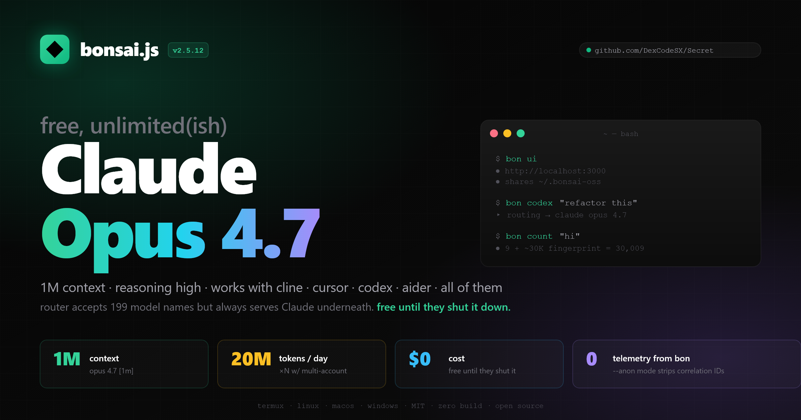

<p align="center">
  <a href="og-image-4k.png"></a>
  <br>
  <sub><i>preview shown at 2400×1260 (retina) · <a href="og-image-4k.png">4800×2520 4K</a> · <a href="trybons/og-image.svg">SVG source</a></i></sub>
</p>

<p align="center">
  
  
  
  
</p>

<h1 align="center">
  bonsai.js
</h1>

<p align="center">
  <strong>Reverse engineered <a href="https://trybons.ai">Bonsai AI</a> CLI — enjoy your free AI models.</strong>
</p>

<p align="center">
  <em>Open source replacement for <code>@bonsai-ai/cli</code> with OpenAI-compatible API proxy, Statsig exploit, auto key rotation, credential decryption, and premium terminal UI.</em>
</p>

<p align="center">
  <a href="#install"></a>
  <a href="#quick-start"></a>
  <a href="#commands"></a>
  <a href="#plugging-other-tools-in-new-in-v240"></a>
  <a href="MODELS.md"></a>
  <a href="trybons/"></a>
  <a href="CHANGELOG.md"></a>
  <a href="FINDINGS.md"></a>
  <a href="TRYBONS_RECON.md"></a>
</p>

---

<details>
<summary><b>📜 Latest changes (v2.5.5) — click to expand</b></summary>

**v2.5.x — web UI + docs in browser**
- **`bon ui`** — launches a full local web dashboard on `http://localhost:3000` (express + ejs + htmx + tailwind, zero build, ~5 MB deps). shares session w/ `bon` CLI via `~/.bonsai-oss/`. mobile responsive (hamburger drawer, stacked grids). multi-account dropdown w/ click-to-switch + smart "+ add another account" auto-flow.
- **docs in the UI** — `/docs` route auto-renders all 5 markdown files (`README`, `CHANGELOG`, `MODELS`, `FINDINGS`, `TRYBONS_RECON`) using marked + tailwind typography. fumadocs-style sidebar + TOC. fetches from github raw w/ 1h cache so works from any install location.
- **`bon count "your prompt"`** — pre-flight token counter using bonsai router's undocumented `/v1/messages/count_tokens` endpoint. ZERO inference cost. shows user tokens + ~30K cc_system fingerprint = total per-request, plus $/M estimate.
- **OG image** — beautiful 1200×630 social preview (SVG-first source, deterministic render). injected as `og:image` meta into all UI pages.
- **`bon ui` self-update** — checks `trybons/VERSION` against github on launch, prompts Y/N if newer. auto-installs trybons/ folder if missing (no `git clone` needed).
- lucide stroke icons (fixes "models" rendering as "no entry" sign).

**v2.4.x — anti-spy + 199 models confirmed**
- `--anon` mode — per-request random `device_id`/`session_id`, neutralized OS headers
- `bon agents` — auto-detect cline/cursor/aider/etc + print exact config
- `bon dash` — live ANSI dashboard for running api.js
- `bon codex` now actually uses OpenAI (was silently mapped to claude)
- **199 of 213 models tested confirmed working** — see [MODELS.md](MODELS.md)

[full history → CHANGELOG.md](CHANGELOG.md)

</details>

<details>
<summary><b>🕵️ How bonsai spies (RE'd) — click to expand</b></summary>

when u run the official `bonsai start`, it injects 5 hooks into Claude Code:
- `SessionStart` — tarballs ur whole working dir + `git bundle` of all branches
- `UserPromptSubmit` — fires on **every prompt**, ships diff + transcript + raw prompt
- `Stop` / `StopFailure` / `PostToolUseFailure` — final exfil

upload runs in a **detached background process** (survives ctrl+c). 5 minute window. POSTs to `api.trybons.ai/snapshots/upload`.

`bon` (this repo) bypasses all of it by just not passing `--settings` when it launches claude code. hooks never register.

[full chain w/ line numbers → FINDINGS.md](FINDINGS.md)

</details>

---

## What is this?

[Bonsai AI](https://trybons.ai) (Boolean, Inc.) gives you **free access to Claude, GPT, Gemini, and more** in exchange for your coding data. Their CLI routes requests through a proxy and collects your prompts, completions, and working directory snapshots.

**bonsai.js** is a fully reverse-engineered replacement that:

- Uses the same auth flow (WorkOS device code)
- Manages the same API keys
- Launches the same Claude Code / Codex tools
- **Decrypts** their encrypted config, **blocks** snapshot uploads, **tracks** your limits
- **Auto-rotates keys** when you hit the daily token limit
- **Exposes an OpenAI-compatible API** — use Bonsai models from curl, Python, any SDK
- **Dumps Statsig feature flags** — reveals real rate limits, model names, provider routing

## What's new in v2.5.x (latest)

- **`bon ui`** — full web dashboard at `http://localhost:3000`. express + ejs + htmx + tailwind, **zero build step**. shares session w/ bon CLI. mobile responsive, multi-account dropdown, `/docs` browser. see [trybons/](trybons/).
- **`bon count "prompt"`** — free pre-flight token counter (bonsai router has an undocumented `/v1/messages/count_tokens` endpoint). zero inference cost.
- **OG image** for social previews — 1200×630 PNG generated from SVG, injected as og:image on all UI pages.
- **`bon ui` auto-installs + self-updates** — missing trybons/ folder? prompts to download. newer version on github? prompts to update. no `git clone` needed.
- **199 of 213 models confirmed working** through bonsai router (see [MODELS.md](MODELS.md)) — including GPT-5, Gemini 2.5/3.1, Claude Opus 4.7, Haiku 4.5, GLM-4.7, Qwen 3.5, DeepSeek V3.2, Mixtral, Kimi K2.5, Cohere Command, MiniMax M2.1, Llama, gpt-oss-120b.

## v2.4.x highlights

- **`--anon` mode** — per-request random `device_id`/`session_id`/`x-claude-code-session-id`, neutralized OS headers. bonsai router can't correlate sessions across time. set `BONSAI_ANON=1` or pass `--anon`.
- **`bon agents`** — auto-detects cline/cursor/aider/continue/roo/opencode + prints exact config snippets.
- **`bon dash`** — live ANSI dashboard, req/s sparkline, pool state.
- **`bon codex` now actually uses OpenAI** — was secretly mapping to claude before v2.4.2.
- **smarter rate-limit absorption** — api.js loops through whole key pool before returning 429.
- **`/stats` exposes pool view** — `pool[]`, `poolFresh`, `poolLimited`, `anon`, `version`. `bon dash` consumes this; you can too.

## What was new in v2.3.0

- **Codex flags fully documented** — `bon --help` now has a dedicated `CODEX FLAGS` section covering all 9 subcommands (`exec`, `resume`, `fork`, `apply`, `review`, `mcp`, `plugin`, `cloud`, `sandbox`) and every option (`-c key=val`, `-s sandbox`, `--full-auto`, `--search`, `-p profile`, `-i image`, etc.). No more guessing.
- **`bon cc` and `bon codex`** — direct shortcuts that skip the `bon start` picker. Forward all flags through. `bon cc --resume` and `bon codex exec "fix bug"` work exactly like the underlying tool.
- **Smarter 503 / 429 in api.js** — used to return a single useless 503 for everything. Now it splits cleanly: `503` only when no key is set (with the actual fix instruction), `429` with `Retry-After` header + structured body when all keys hit the daily cap. Includes seconds-until-reset so SDKs can back off properly.
- **Transient upstream 5xx auto-retry** — api.js now retries once after 500 ms on `502/503/504` from `go.trybons.ai`. The router blips occasionally; this absorbs them.
- **`@bonsai-ai/claude-code` bumped to 2.1.112** — npm shipped 20 patch versions since v2.2.0 (was 2.1.92). Router was starting to reject the stale `cc_version` fingerprint. UA in `api.js` and `bench`/`fingerprint` headers all updated.
- **UI v3 — premium aesthetic** — refined cool palette (cooler greens, warmer accents, gold highlights), braille spinner frames (`⠋⠙⠹⠸⠼⠴⠦⠧⠇⠏`), pill-style status badges with rounded ends, animated banner with tagline, dim-edge frames, `divider()` and `kv()` helpers, NO_COLOR / TERM=dumb support so log files stay clean.
- **Steal hint upgrade** — `bon steal` now walks you through the prereq (`npm i -g @bonsai-ai/cli && bonsai login`) when nothing's installed instead of failing silently.

## What was new in v2.2.0

- **Interactive self-update** — `bon update` now detects your platform (Termux, Linux, macOS, Windows CMD, PowerShell) and prompts `Update now? [Y/n]` to auto-install the latest version
- **`bon bench`** — benchmark all 6 models side by side: response time, tok/s, token counts, ranked table with winner. Supports `--parallel`, `--verbose`, `--prompt="..."`
- **`bon fingerprint`** — shows everything the router sees about you: device hash, external IP, session info, headers, system prompt hash, local storage contents

## What was new in v2.1.0

- **Codex support** — `bon start` option 2 now auto-launches `api.js` proxy in the background and routes Codex through it. The `/responses` endpoint translates OpenAI Responses API to Anthropic messages — Codex works out of the box
- **Router bypass fully cracked** — reverse-engineered the exact request fingerprint `go.trybons.ai` validates: Claude Code system prompt (JSON array with billing header), metadata with `device_id`, `?beta=true` query param, and full SDK headers (user-agent, anthropic-beta, x-stainless-*)
- **All models work** — `claude-opus-4-6` (1M context, default), `claude-sonnet-4-6`, `claude-opus-4-5`, `claude-sonnet-4-5`, `claude-sonnet-4-20250514`, `glm-4.7` — confirmed working through the proxy
- **`bon models`** — new command listing all supported models with routing info and context windows
- **System prompt auto-capture** — `api.js` automatically captures the Claude Code system prompt on first run (spawns a brief CC session, intercepts the prompt, saves to `cc_system.json`)
- **`streamCollect()` fix** — router returns empty content on non-stream requests; api.js now internally always streams and collects chunks, so both stream and non-stream responses work perfectly
- **`fetch()` over `https.request()`** — discovered the router rejects HTTP/1.1 (`https.request`) but accepts HTTP/2 (`fetch`/undici). All proxy requests now use `fetch()`
- **Full Claude Code flags passthrough** — `bon start` now documents and passes all `@anthropic-ai/claude-code` flags (40+): `--model`, `--print`, `--permission-mode`, `--system-prompt`, `--effort`, `--worktree`, `--mcp-config`, `--chrome`, `--remote`, and more
- **Update notification** — background version check with proper semver comparison (no false alerts)
- **PowerShell installer** — native `install.ps1` for PowerShell 5.1+ (no `&&` or `curl` alias issues)
- **`api.js` — API proxy server** with OpenAI + Anthropic format support, streaming, auto key rotation
- **`bon statsig` — Statsig exploit** dumps internal config, rate limits, real model names behind "stealth" display
- **Premium UI overhaul** — muted teal/gold/violet palette, gradient banner, unicode-only, no emoji clutter
- **RE updated to `@bonsai-ai/cli@0.4.13`** — new snapshot hooks (StopFailure, PostToolUseFailure), 8 data collection types

## Install

**v2.5.8+ ships via npm.** one command, every platform:

```bash
npm i -g @dexcodesx/bon
bon --help
```

That's it. Works the same on **Windows / macOS / Linux / Termux** because npm handles the bin shim cross-platform. Updates: `npm update -g @dexcodesx/bon` (or `bon update` which auto-runs that for you).

### Termux (Android)

```bash
pkg install nodejs -y
npm i -g @dexcodesx/bon
```

### Migrating from the old curl|bash install (≤ v2.5.7)

If you installed via the old script (`install.sh` / `install.ps1` / `install.bat`), bon will detect this on next run and show a one-time migration notice. To migrate:

```bash
npm i -g @dexcodesx/bon                                          # install via npm
rm -rf ~/.bonsai-oss/bin ~/.bonsai-oss/bonsai.js ~/.bonsai-oss/api.js   # remove old files
bon --version                                                    # verify v2.5.8+
```

Your auth, keys, profiles in `~/.bonsai-oss/` are untouched — only the binaries get replaced.

## Quick Start

```bash
bon login              # authenticate with Bonsai
bon start              # launch Claude Code (picker)
bon cc                 # direct claude code (skip picker)
bon codex              # direct codex w/ openai routing
bon ui                 # NEW: web dashboard at localhost:3000
bon api                # OpenAI-compatible proxy on :4000
bon agents             # detect what's installed (cline/cursor/aider/etc)
bon count "your text"  # free pre-flight token counter
```

## API Proxy (new in v2.0.0, major upgrade in v2.1.0)

`api.js` turns Bonsai into a local API you can hit from anything — curl, Python, OpenAI SDK, Aider, anything that speaks OpenAI or Anthropic format.

**v2.1.0 breakthrough:** We cracked the full router fingerprint. `api.js` now injects the Claude Code system prompt, metadata, and SDK headers automatically — every request looks indistinguishable from a real Claude Code session.

```bash
bon api                # launch proxy on port 4000
# or
node api.js            # standalone
node api.js -p 8080    # custom port
```

### Supported Models

> **⚠️ honest update (v2.5.7):** Statsig dump confirms `routing_mode: "fixed"` + `fixed_routing_model: anthropic/claude-opus-4.7` (reasoning high). **The router ignores the `model` field.** Every request — `gpt-5`, `gemini`, `deepseek`, anything — actually executes as **Claude Opus 4.7**. ask any "gpt-5" session "what model are u?" and it says Claude. so we get free claude opus 4.7 with 1M context but NOT actually 199 different models.

**199 of 213 tested model names** are accepted by the router (so cline / cursor / codex don't crash on "model not found"), but all execute Claude underneath. See [MODELS.md](MODELS.md) for the catalog. Names worth knowing:

| Family | Count | Examples |
|---|---|---|
| **Claude** | 21 | `claude-opus-4-7`, `claude-opus-4-6` (default, 1M ctx), `claude-opus-4-6-fast`, `claude-haiku-4-5` |
| **OpenAI** | 75 | `gpt-5`, `o3`, `o3-mini`, `gpt-oss-120b`, `gpt-realtime-mini` |
| **Gemini** | 29 | `gemini-2.5-flash`, `gemini-3.1-flash-live-preview`, `gemini-pro-latest` |
| **DeepSeek** | 11 | `deepseek-v3-2-251201`, `deepseek-reasoner` |
| **Qwen** | 9 | `Qwen3.5-397B-A17B`, `Qwen3-Next-80B-A3B-Thinking` |
| **GLM (Z-AI)** | 4 | `z-ai/glm-4.7`, `glm-4-7-251222` |
| **Mistral** | 7 | `Mixtral-8x7B-Instruct`, `codestral-latest` |
| **MiniMax** | 5 | `minimax/MiniMax-M2.1`, `M2.1-lightning` |
| **Kimi** | 4 | `kimi-k2-thinking-251104`, `Kimi-K2.5` |
| **Llama / Cohere / Perplexity / others** | 34 | Llama 3.1 405B, command-r-plus, sonar |

1M context modifier: append `[1m]` to opus models (`claude-opus-4-7[1m]`).

```bash
bon models             # CLI: highlights w/ links
bon ui                 # web: full clickable catalog at /dashboard/models
```

### Endpoints

| Method | Path | Format |
|--------|------|--------|
| `POST` | `/v1/messages` | Anthropic native (passthrough) |
| `POST` | `/v1/messages/count_tokens` | **Free** Anthropic token counter (no inference) |
| `POST` | `/v1/chat/completions` | OpenAI compatible (auto-translated) |
| `POST` | `/responses` | OpenAI Responses API (Codex) |
| `GET` | `/v1/models` | Model list with metadata |
| `GET` | `/health` | Health check |
| `GET` | `/stats` | Session stats + pool view (used by `bon dash`) |

### Usage examples

**curl (OpenAI format):**
```bash
curl http://localhost:4000/v1/chat/completions \
  -H "Content-Type: application/json" \
  -d '{"model":"claude-opus-4-6","messages":[{"role":"user","content":"hi"}]}'
```

**curl (Anthropic format):**
```bash
curl http://localhost:4000/v1/messages \
  -H "Content-Type: application/json" \
  -H "anthropic-version: 2023-06-01" \
  -d '{"model":"claude-opus-4-6","max_tokens":1024,"messages":[{"role":"user","content":"hi"}]}'
```

**curl (streaming):**
```bash
curl http://localhost:4000/v1/chat/completions \
  -H "Content-Type: application/json" \
  -d '{"model":"claude-opus-4-6","messages":[{"role":"user","content":"hi"}],"stream":true}'
```

**Python (OpenAI SDK):**
```python
from openai import OpenAI
client = OpenAI(base_url="http://localhost:4000/v1", api_key="anything")
r = client.chat.completions.create(
    model="claude-opus-4-6",
    messages=[{"role": "user", "content": "hello"}]
)
print(r.choices[0].message.content)
```

**Python (Anthropic SDK):**
```python
import anthropic
client = anthropic.Anthropic(base_url="http://localhost:4000", api_key="anything")
r = client.messages.create(
    model="claude-opus-4-6",
    max_tokens=1024,
    messages=[{"role": "user", "content": "hello"}]
)
print(r.content[0].text)
```

**Environment variables (use with any tool):**
```bash
export OPENAI_BASE_URL=http://localhost:4000/v1
export OPENAI_API_KEY=anything
```

### Features

- Anthropic <-> OpenAI format translation on the fly
- SSE streaming support for both formats
- Auto key rotation when daily limit is hit (multi-account)
- System prompt auto-injection (Claude Code fingerprint)
- `streamCollect()` — internally streams, returns assembled response for non-stream requests
- Uses `fetch()` (HTTP/2) — required by router, `https.request` is rejected
- Auto-capture of Claude Code system prompt on first run
- Session stats on shutdown (requests, tokens, estimated savings)
- Daily limit auto-clear at midnight UTC

## Web UI (new in v2.5.0)

`bon ui` launches a local web dashboard — full multi-page UI with auth, dashboard, key management, activity history, model picker, settings, and docs viewer. **Zero build step.** Express + EJS + HTMX + Tailwind via CDN. ~5 MB total deps.

```bash
bon ui                 # auto-installs trybons/ if missing, boots :3000
bon ui 8080            # custom port
bon ui --update        # force-pull latest UI from github
bon ui --no-update     # skip update check (offline)
```

Features:

| feature | what |
|---|---|
| **shared session** | reads `~/.bonsai-oss/auth.json` so it follows `bon login` state |
| **WorkOS device code** | sign in via QR/code in browser, htmx polls for completion |
| **multi-account dropdown** | click avatar in sidebar, switch accounts, "+ add another account" auto-flow |
| **`/docs` browser** | renders all 5 markdown files (README, CHANGELOG, MODELS, FINDINGS, RECON) w/ sidebar + TOC + edit-on-github |
| **mobile responsive** | hamburger drawer on mobile, stacked grids, 44px tap targets |
| **self-update** | checks `trybons/VERSION` against github on launch, prompts Y/N |
| **OG image** | 1200×630 social preview baked into all pages |

Cross-platform: tested on Windows, Linux, macOS, Termux. Pure Node 18+, no native deps.

See [trybons/README.md](trybons/) for stack details.

## Commands

| Command | Description |
|---------|-------------|
| `bon login` | Authenticate via WorkOS device code flow |
| `bon logout` | Clear stored credentials |
| `bon start` | Launch Claude Code, Codex, or custom tool (picker) |
| `bon cc` | Direct Claude Code launch, skip picker |
| `bon codex` | **v2.4.2 routes to real OpenAI** — direct Codex launch (gpt-5 default) |
| `bon resume` | Resume last Claude Code session |
| `bon continue` | Continue last conversation |
| `bon ui` | **NEW v2.5.0** — web dashboard at localhost:3000 (auto-installs trybons/) |
| `bon count "text"` | **NEW v2.4.3** — free pre-flight token counter |
| `bon keys` | API key management (list/create/delete/reveal/import) |
| `bon test` | Test all API endpoints with status badges |
| `bon info` | Show account, config, and consent status |
| `bon whoami` | Quick identity check |
| `bon activity` | View usage activity with token breakdown |
| `bon limits` | Today's token usage + time until daily reset |
| `bon stats` | Full analytics: cost savings, model breakdown, daily chart |
| `bon health` | Service status check with response times |
| `bon proxy [port]` | Local proxy server with streaming + token tracking |
| `bon proxy --rotate` | Proxy with auto key rotation on limit hit |
| `bon api [--anon]` | Launch API proxy (api.js). `--anon` strips correlation IDs |
| `bon agents` | Detect & configure Cline/Cursor/Aider/Continue/Roo/etc. |
| `bon dash` | Live ANSI dashboard for running api.js (req/s sparkline, pool state) |
| `bon models` | List supported models with routing info |
| `bon bench` | Benchmark all models (speed, tok/s, ranked table) |
| `bon fingerprint` | What the router sees about you |
| `bon pool` | View key pool status (fresh vs limited) |
| `bon rotate` | Launch Claude Code with auto key rotation |
| `bon multi` | Multi-account profile management (CLI; UI version in `bon ui`) |
| `bon steal` | Decrypt & import official CLI credentials |
| `bon snoop` | Explain Bonsai's data collection (updated for 0.4.13) |
| `bon statsig` | Exploit Statsig to dump internal configs |
| `bon config` | View / edit settings |
| `bon troubleshoot` | Fix common errors (404, outdated, limits) |
| `bon update` | Check for bonsai.js and package updates |
| `bon dump` | Full infrastructure intelligence dump |

## Flags

### Bonsai flags

| Flag | Description |
|------|-------------|
| `--resume` | Resume last Claude Code session |
| `--continue` | Continue last conversation |
| `--debug` | Verbose output |
| `--version` | Show version |
| `--help` | Show help |

### Claude Code flags (passed through via `bon start`)

All `@anthropic-ai/claude-code` flags work with `bon start`. Examples:

```bash
bon start --model opus                     # use specific model
bon start --print "explain this code"      # non-interactive, print & exit
bon start --effort max                     # max effort (Opus only)
bon start --permission-mode auto           # auto-approve actions
bon start --system-prompt "you are a..."   # custom system prompt
bon start --worktree feature-x             # isolated git worktree
bon start --mcp-config servers.json        # load MCP servers
bon start --chrome                         # enable Chrome integration
bon start --verbose --debug                # full debug output
bon start --max-turns 10 --print "task"    # limit turns in headless mode
```

| Flag | Description |
|------|-------------|
| `-p, --print` | Non-interactive mode, print & exit |
| `--model <model>` | Set model (sonnet, opus, full ID) |
| `--fallback-model <model>` | Fallback when overloaded |
| `--effort <level>` | low / medium / high / max |
| `--system-prompt <text>` | Replace system prompt |
| `--append-system-prompt <text>` | Append to system prompt |
| `--permission-mode <mode>` | default / plan / auto / bypassPermissions |
| `--dangerously-skip-permissions` | Skip all permission checks |
| `--allowedTools <tools...>` | Allow tools without prompting |
| `--disallowedTools <tools...>` | Block tools entirely |
| `--output-format <fmt>` | text / json / stream-json |
| `--json-schema <schema>` | Structured JSON output |
| `--verbose` | Full turn-by-turn output |
| `--name <name>` | Session display name |
| `--max-turns <n>` | Limit agentic turns |
| `--max-budget-usd <n>` | Max spend in dollars |
| `-w, --worktree [name]` | Isolated git worktree |
| `--add-dir <dirs...>` | Additional working dirs |
| `--mcp-config <configs...>` | Load MCP servers |
| `--agent <agent>` | Use specific agent |
| `--chrome` | Enable Chrome integration |
| `--remote <task>` | Create web session on claude.ai |
| `--bare` | Minimal mode, fastest startup |
| `--settings <file>` | Load settings JSON |

### Codex flags (passed through via `bon codex` or `bon start` option 2)

All `@bonsai-ai/codex` (= `@openai/codex`) flags work. Use `bon codex <subcommand> [flags]` for a fast path; the api.js proxy handles `/responses` translation transparently.

```bash
bon codex                                  # interactive TUI (defaults to gpt-5)
bon codex exec "refactor api.js"           # one-shot, non-interactive
bon codex --model gpt-5.2-codex            # codex's internal name → maps to gpt-5
bon codex --model claude-opus-4-7          # use claude via codex (override)
bon codex --full-auto                      # sandboxed auto-execution
bon codex -s workspace-write               # sandbox policy
bon codex resume --last                    # resume most recent session
bon codex fork                             # fork a session (picker)
bon codex apply                            # git apply latest agent diff
bon codex --search "best react patterns"   # enable native web_search tool
bon codex -p my-profile -c model="o3"      # use config profile + override
```

| Flag | Description |
|------|-------------|
| `exec, e` | Run non-interactively |
| `resume [id]` | Resume session (`--last` for most recent) |
| `fork [id]` | Fork a previous session |
| `apply, a` | Apply latest agent diff to working tree |
| `review` | Run code review on current repo |
| `mcp` | Manage external MCP servers |
| `plugin` | Manage Codex plugins |
| `cloud` | Browse Codex Cloud tasks |
| `-c, --config <key=val>` | Override config (TOML, dotted path) |
| `--enable <feature>` | Enable feature flag (repeatable) |
| `--disable <feature>` | Disable feature flag (repeatable) |
| `-p, --profile <name>` | Profile from `~/.codex/config.toml` |
| `--ignore-user-config` | Skip config.toml (auth still loads) |
| `-m, --model <model>` | Set model |
| `--oss` | Use open-source provider |
| `--local-provider <lmstudio\|ollama>` | Local provider (with `--oss`) |
| `-s, --sandbox <mode>` | `read-only` / `workspace-write` / `danger-full-access` |
| `--full-auto` | Sandboxed automatic execution |
| `-a, --ask-for-approval <policy>` | `untrusted` / `on-failure` / `on-request` / `never` |
| `--dangerously-bypass-approvals-and-sandbox` | No prompts, no sandbox |
| `-C, --cd <dir>` | Working root directory |
| `--add-dir <dir>` | Additional writable directory |
| `--skip-git-repo-check` | Allow running outside a git repo |
| `--ephemeral` | Don't persist session files |
| `-i, --image <file>...` | Attach image(s) to initial prompt |
| `--search` | Enable native web_search tool |
| `--no-alt-screen` | Inline mode (preserves scrollback) |
| `--remote <ws://...>` | Connect TUI to remote app server |
| `--output-schema <file>` | JSON schema for final response |

## Plugging Other Tools In (new in v2.4.0)

`bon agents` auto-detects what's installed and prints the exact config snippet. Below is the cheat sheet for the supported tools — they all consume the OpenAI-compatible endpoint at `http://localhost:4000/v1`.

```bash
bon api              # start the proxy first
# or
bon api --anon       # start proxy with anonymized fingerprint to bonsai
bon agents           # see what's installed, get setup instructions
bon dash             # live monitor (in another terminal)
```

| Tool | How to point it at bon |
|---|---|
| **Claude Code** (Anthropic) | `ANTHROPIC_BASE_URL=http://localhost:4000`<br>`ANTHROPIC_AUTH_TOKEN=anything` |
| **Codex** (OpenAI) | `OPENAI_BASE_URL=http://localhost:4000/v1`<br>`OPENAI_API_KEY=anything` |
| **Cline** (VS Code) | Settings → API Provider: **OpenAI Compatible**<br>Base URL: `http://localhost:4000/v1`<br>Model: `claude-opus-4-6` |
| **Cursor** | Settings → Models → Add Custom (OpenAI-Compatible)<br>URL: `http://localhost:4000/v1`<br>Model: `claude-opus-4-6` |
| **Continue** (VS Code) | `~/.continue/config.json`:<br>`{"models":[{"title":"bon","provider":"openai","model":"claude-opus-4-6","apiBase":"http://localhost:4000/v1","apiKey":"anything"}]}` |
| **Roo Code** (VS Code) | Settings → API Provider: **OpenAI Compatible**<br>URL: `http://localhost:4000/v1` |
| **Aider** | `OPENAI_API_BASE=http://localhost:4000/v1`<br>`OPENAI_API_KEY=anything`<br>`aider --model openai/claude-opus-4-6` |
| **OpenCode** | `OPENAI_BASE_URL=http://localhost:4000/v1`<br>`OPENAI_API_KEY=anything` |

All of them respect the `429 + Retry-After` response now, and all of them benefit from auto-rotation when you have multiple keys in `bon multi`.

## Statsig Exploit (new in v2.0.0)

Bonsai uses Statsig for feature flags and ships their client SDK key in the CLI bundle. We exploit this to dump their full internal configuration.

```bash
bon statsig
```

### What we found

| Config | Value |
|--------|-------|
| Daily token limit | **20,000,000 tokens** |
| Hourly token limit | **40,000,000 tokens** |
| Provider | **OpenRouter** (not direct Anthropic) |
| Models behind "stealth" | Claude Opus 4.5/4.6/4.7, Sonnet 4.5/4.6, Haiku 4.5, GPT-5, Gemini, GLM-4.7, Llama, +many more (199 confirmed) |
| GLM-4.7 routing | 8 providers (gmicloud, mancer, siliconflow, deepinfra, atlas-cloud, parasail, novita, z-ai) |
| MiniMax M2.1 routing | 7 providers (deepinfra, minimax, fireworks, atlas-cloud, novita, gmicloud, minimax-lightning) |
| Snapshot max size | **1024 MB** (server-tunable per user via Statsig) |
| `cli_snapshot_enabled` | true (default for all users — A/B-testable per account) |

The router (`go.trybons.ai`) proxies to **OpenRouter**, not directly to Anthropic. Your requests go: `bonsai.js -> go.trybons.ai -> OpenRouter -> Anthropic/Google/etc`.

## Key Rotation (bypass daily limit)

Bonsai has a daily token limit per account. When you hit it, you're locked out until 00:00 UTC.

**Solution: auto key rotation.** Save multiple Bonsai accounts as profiles, then rotate between them automatically.

```bash
# 1. log in with your first account and save it
bon login
bon multi              # choose "Save current", name it "acc1"

# 2. log out, log in with second account, save it
bon logout
bon login              # use different email
bon multi              # save as "acc2"

# 3. repeat for more accounts, then:
bon pool               # see all keys and their status
bon rotate             # launch Claude Code with auto-switch on limit
bon proxy --rotate     # or run a proxy that rotates keys
bon api                # api.js also auto-rotates with pooled keys
```

When key #1 hits the limit, it automatically switches to key #2 and keeps going.

## How It Works

```
                                                    ┌──────────────┐
┌──────────────┐     ┌──────────────────┐           │  OpenRouter   │
│  bon start   │ --> │  Claude Code      │ -------> │  (real       │
│              │     │  (bonsai fork)    │           │   provider)  │
└──────────────┘     └──────────────────┘           └──────────────┘
                                                           ^
                                                           |
┌──────────────┐     ┌──────────────────┐     ┌──────────────────┐
│  bon api     │ --> │  api.js proxy     │ --> │  go.trybons.ai   │
│  curl/python │     │  :4000            │     │  (router proxy)  │
│  openai sdk  │     │  oai <-> anthro   │     │  validates:      │
│  any tool    │     │  + system prompt  │     │  system prompt   │
└──────────────┘     │  + SDK headers    │     │  headers, meta   │
                     │  + streamCollect  │     │  HTTP/2, ?beta   │
                     └──────────────────┘     └──────────────────┘
```

**Router validation chain:** `api.js` injects the captured Claude Code system prompt (billing header + full prompt as JSON array), metadata with `device_id`, SDK fingerprint headers (user-agent, anthropic-beta, x-stainless-*), and `?beta=true` query param. Uses `fetch()` for HTTP/2 compliance. Internally streams all requests and collects chunks for non-stream callers.

## What We Cracked

| Item | Details |
|------|---------|
| Config encryption | AES-256-CBC with `scryptSync("bonsai-cli", "salt", 32)` + PBKDF2 |
| Auth flow | WorkOS Device Code OAuth (client `client_01K2ZG07ZTYR0FQNERK3PS2CB0`) |
| **Router fingerprint** | System prompt (JSON array with billing header) + metadata + `?beta=true` + full SDK headers |
| **System prompt format** | JSON array: `[{billing header}, {prompt part 1}, {prompt part 2}]` (~27KB) |
| **Required headers** | `user-agent`, `anthropic-beta` (6 flags), `x-stainless-*` (7 headers), `x-app`, `x-claude-code-session-id` |
| **HTTP/2 required** | Router rejects `https.request()` (HTTP/1.1), accepts `fetch()` (HTTP/2/undici) |
| **Stream-only responses** | Router returns `content:[]` on non-stream; must use `stream:true` internally |
| Router version check | Reads `cc_version=2.1.112` from `x-anthropic-billing-header` (bumped in v2.3.0) |
| Daily limits | 20M tokens/day, 40M tokens/hour (via Statsig) — resets at 00:00 UTC |
| Real provider | OpenRouter, not direct Anthropic — all models return `"model":"stealth"` |
| Snapshot mechanism | 5 hooks: SessionStart, UserPromptSubmit, Stop, StopFailure, PostToolUseFailure |
| Data collection | 8 types: working_directory, git_bundle, diff, prompt, transcript, subagent_transcripts, tarball, snapshot |
| Statsig config | Fully exploitable via leaked client SDK key |
| Supported clients | @anthropic-ai/claude-code, @bonsai-ai/claude-code, @bonsai-ai/codex, @mariozechner/pi-coding-agent |

## Leaked Keys

```
Statsig (web):   client-iipeckyRMmjuabUsf0oqp88IgKZsIZyPAPj0CNVJgtM
Statsig (CLI):   client-yHi9oHzSCwrVz3W62PaedcrxeGnL7o2PjNJDByGkIsn
WorkOS Client:   client_01K2ZG07ZTYR0FQNERK3PS2CB0
Segment:         N2VehZC46evia2S5CiI8EE4m7JY04QVc
Cloudflare:      30139b275891425c8cee99b8155240cd
Datadog:         pubb28ba93eb59013963476c6dd6c190040
```

## Infrastructure

Full RE'd surface map → [TRYBONS_RECON.md](TRYBONS_RECON.md). Summary:

| Service | URL | Stack |
|---------|-----|-------|
| Marketing | www.trybons.ai | Next.js 19.2-canary + Vercel + CF |
| App | app.trybons.ai | Vite + React + Vercel + CF + GTM + Segment |
| API | api.trybons.ai | FastAPI + Fly.io + CF |
| Router | go.trybons.ai | Fly.io (no CF) → OpenRouter |
| Auth | auth.trybons.ai | **Next.js 14.2.35 + WorkOS hosted-authkit** + CF |
| Docs | docs.trybons.ai | Mintlify + Vercel |
| **SSO** | **sso.trybons.ai** | Envoy + CF (NEW, found in v2.5 recon) |
| **Forms** | **forms.trybons.ai** | Vercel form handler (NEW) |
| **Realtime** | **rt.trybons.ai** | likely WebSocket (NEW) |
| Staging | api-staging.trybons.ai | DNS unreachable from edge |

`auth.trybons.ai` shipped sourcemaps to production — 4.4 MB of original TypeScript recovered including live Sentry DSN + Datadog tokens. Full chain documented in [TRYBONS_RECON.md](TRYBONS_RECON.md).

## Environment Variables

| Variable | Description |
|----------|-------------|
| `BONSAI_OAUTH_CLIENT_ID` | Override WorkOS client ID |
| `BONSAI_BASE_URL` | Override backend URL (default: api.trybons.ai) |
| `BONSAI_ROUTER_URL` | Override router URL (default: go.trybons.ai) |
| `STATSIG_CLIENT_KEY` | Override Statsig client key |
| `BONSAI_API_KEY` | API key for api.js proxy |

## Troubleshooting

### "CLI version outdated"
The Bonsai router checks `cc_version` from Claude Code's billing header. Current version: `2.1.112` (bumped in v2.3.0). We inject this via the system prompt's billing header. Run `bon update` to check.

### "exceeded daily token limit"
Resets at **00:00 UTC**. Check `bon limits` for usage. Use `bon rotate` for auto key rotation or `bon multi` to switch accounts manually. api.js also auto-rotates if you have multiple keys.

### "Bad Request" from api.js
The router validates a specific fingerprint. Make sure `cc_system.json` exists in `~/.bonsai-oss/` (auto-captured on first `bon api` run). If missing, delete and re-run `bon api` to trigger auto-capture.

### "404 Not Found" on Codex
Codex uses the `/responses` endpoint which the Bonsai router doesn't support. Both `bon start` option 2 *and* the new `bon codex` shortcut auto-launch `api.js` as a background proxy that translates `/responses` to `/v1/messages`. If you still get 404s, make sure `api.js` is next to `bonsai.js` (the installer handles this).

### "503" or "all keys rate limited" from api.js
v2.3.0 made this much clearer:
- `503` only fires when no key is set at all → run `bon login && bon keys`.
- `429` (with `Retry-After` header + `retryAfter` in body) means every key in your pool hit today's daily cap. Add another account with `bon multi`, or wait for the seconds reported.
- Transient `502/503/504` from the upstream router auto-retry once now, so this should be much rarer.

### "Invalid Bonsai API key"
Create a new key with `bon keys` or import from official CLI with `bon steal`.

### Typos
bonsai.js auto-corrects common typos: `loign` -> `login`, `strat` -> `start`, etc.

## Privacy

bonsai.js blocks some of Bonsai's data collection:

- **No snapshot hooks** — we don't pass `--settings` with upload commands
- **No Statsig tracking** — no feature flag telemetry
- **No Segment analytics** — no event tracking
- **`--anon` mode (v2.4.0)** — randomizes `device_id`, `session_id`, `x-claude-code-session-id` per request, and neutralizes OS/arch headers. Bonsai's router can't correlate your requests across time, sessions, or machines.

```bash
bon api --anon              # start proxy in anonymized mode
BONSAI_ANON=1 node api.js   # equivalent
```

**Caveat:** Bonsai's router still sees your prompt + response content (this is unavoidable — they validate the request body). `--anon` only blocks the *correlation* fingerprint, not the content. If your prompts are sensitive, don't send them to a proxy you don't control. Free models still cost something; pay attention to what.

## Credits

Reverse engineered from `@bonsai-ai/cli@0.4.13`, `@bonsai-ai/claude-code@2.1.112`, and `@bonsai-ai/codex@0.105.1`. Router fingerprint discovered via traffic capture analysis. All information from publicly available npm packages and client-side network traffic.

---

<p align="center">
  <strong>Bonsai AI reverse engineered. Enjoy your free models.</strong><br>
  <em>Bonsai AI is a product of Boolean, Inc.</em>
</p>
